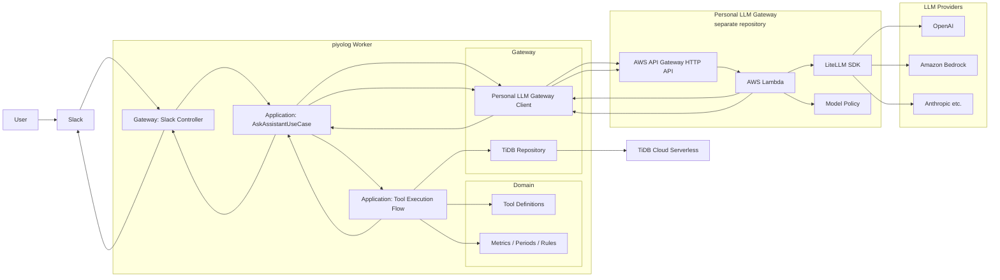
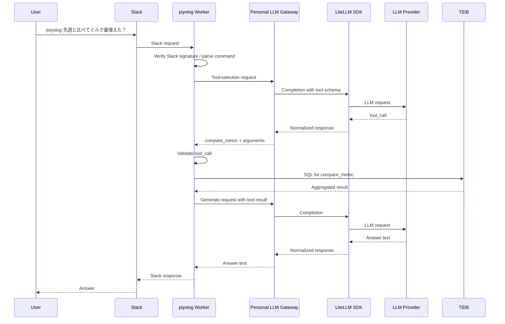

# Architecture

This document describes the planned architecture for the piyolog AI Agent MVP.

## Overview

## Request Flow

## Layer Responsibilities

### Domain

- Defines baby log concepts, metrics, periods, and tool schemas.
- Owns aggregation rules that are independent of Slack, TiDB, or LLM providers.

### Application

- Owns use cases such as `AskAssistantUseCase`.
- Coordinates tool selection, tool validation, tool execution, and answer generation.
- Remains channel-independent so future LINE or Alexa controllers can call the same use case.

### Gateway

- Owns external connections and protocol translation.
- Includes Slack controller, TiDB repository, Personal LLM Gateway client, and HTTP routing.

## Tool Boundary

Tools are defined, validated, and executed inside the piyolog Worker.

Initial tools:

- `compare_metric`: compares a baby-log metric across two periods.
- `summarize_period`: summarizes baby-log records for an arbitrary period.

The Personal LLM Gateway may select a tool and propose arguments, but it must not execute tools or connect to TiDB.

